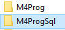
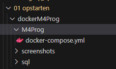
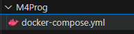
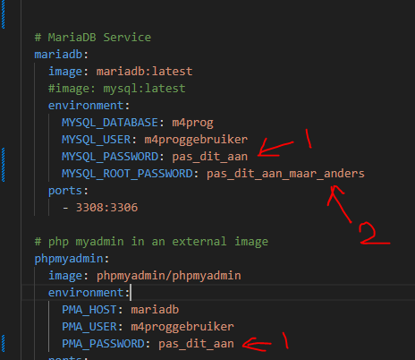

## start:

#### eigen github repository
- maak een nieuw github repository aan:
    - `M4prog`
        - clone deze naar je laptop
            > - dit wordt de directory waar je alles voor dit vak in zet

#### clone de opdrachten

- clone nu mijn github:
    - https://github.com/progsen/M4ProgSql
- zet deze NAAST je `M4prog`

- je krijgt dan dit:
> 

#### kopieeren

- kopieer nu `01 opstarten\dockerM4Prog\M4Prog` naar je eigen `M4Prog`
> 

## simpele docker 

- lees (LET OP):
    > werkt docker niet goed op jou laptop? gebruik de alternatieve installatie:
    > https://github.com/progsen/M4ProgSql/tree/main/01%20opstarten/01%20alt%20installatie

## install

## download compose file

voor onze docker gaan hebben we 2 containers nodig:
- een database
- een phpmyadmin om de database te kunnen beheren

- onder je eigen `M4Prog` heb je nu 
    > 

## wachtwoorden

- open je compose file en bekijk:
    > 
    - `pas_dit_aan` wordt je applicatie wachtwoord
    - `pas_dit_aan_maar_anders` dit is je ROOT wachtwoord van je database server
        - deze moet een goed wachtwoord hebben!!

## docker containers starten

- open je `M4Prog` directory in visual studio
    - daar zie je de compose file onder `M4Prog`
        > 
        - rechter muis klik op die directory
            - `open in intergrated terminal`
                - type nu:  `docker compose up -d`

## M3Prog

- vergelijk de containers die je nu hebt met die uit M3Prog
    - zie je dat we nu een mariadb & phpmyadmin container extra
    - en dat we in net als in M3Prog een php en nginx hebben?

## klaar?

- commit & push naar je git
            