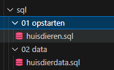
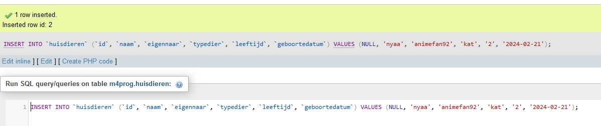
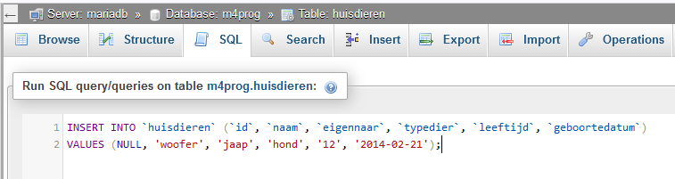
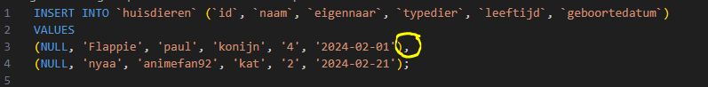
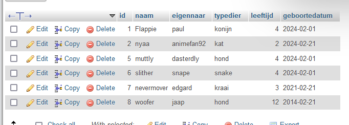

- open je phpmyadmin van `m4prog`
## data in de tabel zetten

Nu gaan we data in de tabel zetten

- maak een nieuwe file:
    - `01 huisdierdata.sql` in je `sql` directory
    > 
        
- maak een rij aan via phpmyadmin
    - open de table en click op `insert`
    > 
- vul zelf data van een huisdier in (mag je zelf verzinnen)

- click op `go`
    - kijk even goed naar het scherm
        > 
        - zie je dat stuk met `insert into....`?
            - dat is de SQL die de `data` in de `tabel` zet
            - `hou dit scherm open!`

## SQL bewaren

```
Vaak is het handig om je SQL te bewaren zodat je het later nogmaals kan `uitrollen`
```

- kopieer de SQL
    - zet deze in je `01 huisdierdata.sql` file
    - click nu op SQL in `phpmyadmin` 
        > als je de `huisdieren table` open hebt
        
    - plak die SQL in het tekstvak
        - pas nu de waarden aan en druk op GO
            > 
            - controlleer of je nu een extra rij hebt
    - zet deze nieuwe sql ook in `01 huisdierdata.sql`

## kan dat makkelijker?


- inserts met SQL zijn makkelijk, alleen wel veel tekst 
    > 

- dit kan makkelijker:
    - we kunnen met 1 insert meerdere rijen maken:
        > 
        - zie je die komma `,` zo kunnen we meerdere rijen maken
        - maak nu `onder` je 2 insert statements in `01 huisdierdata.sql`:
            - een nieuwe insert, met 4 rijen aan (3 kommas en als laatst 1 `;`)
- voer die nieuwe insert ook uit in `phpmyadmin`
    - check of je nu minimaal 6 rijen hebt!
        > 
    

## klaar?

- commit & push naar je git
            