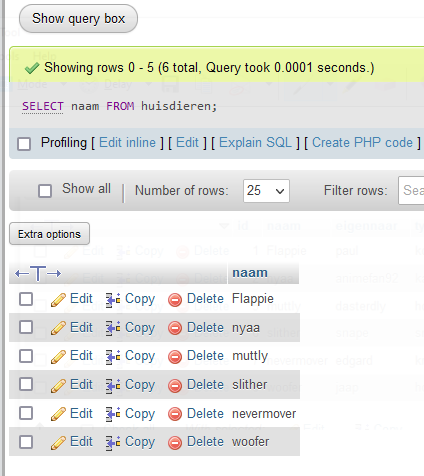
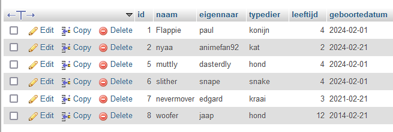
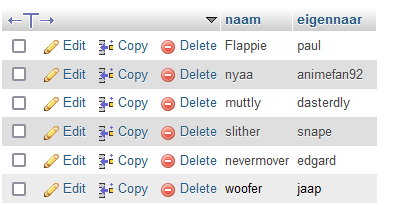

- open je phpmyadmin van `m4prog`
## selecteren

Nu hebben we data, hoe kunnen we die nu gebruiken?
> laten we beginnen met de SELECT statement
> - hiermee halen we data uit 1 of meerdere tabellen

het model is:
> SELECT WELKECOLOMMEN FROM WELKETABEL;

- `WELKECOLOMMEN` is welke colommen je wil zien:
    - bijvoorbeeld de `naam` van het huisdier
- `WELKETABEL` is uit welke tabel je iets wil zien:
    - In ons geval is dat nu `huisdieren`

Dan krijgen we:
> SELECT naam FROM huisdieren

- probeer dat uit in `phpmyadmin`:
    > 
- maak in je `sql` directory nu een nieuwe file:
    - `02 huisdierselect.sql`
    - plak daar je SQL in

## alles

- kopieer de SQL en plak die weer in `02 huisdierselect.sql`
    - nu heb je 2 regels
        - verander van de 1ste `naam` nu in `*`
        - probeer deze in `phpmyadmin`:
        > 

## andere colommen

- kopieer de eerste SQL regel (`met naam`) en plak die weer in `02 huisdierselect.sql`
    - nu heb je 3 regels
        - verander van de 3de `naam` nu in `naam,eigenaar`
        - probeer deze in `phpmyadmin`:
        > 
- maak nog 1 regel, en zorg dat je:
    - 3 andere colommen selecteerd
        - dus `niet` naam en eigenaar
        - probeer je nieuwe statement in `phpmyadmin`
        
## volgorde

- draai nu de colommen om
    > bijvoorbeeld `naam,eigenaar` wordt `eigenaar,naam`
    - kijk wat er gebeurt

## klaar?

- commit & push naar je git
            