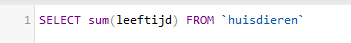
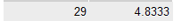
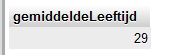

## start

- maak een file aan in de sql directory:
    - `03 rekenen.sql`

## dynamische colommen

Je kan ook dingen selecteren die NIET in de colommen van de tabel staan

- probeer het volgende:
    > 
    > zie je hoe nu de leeftijden worden opgeteld van alle huisdieren?
    - zet de SQL in `03 rekenen.sql`

- probeer nu het gemiddelde van de leeftijden van de huisdieren te selecteren
    - zoek in de documentatie hoe je dat doet

## meerdere dynamische colommen

- selecteer nu:
    - de SUM van leeftijden
    - en daarna het gemiddelde
    > 
    - zet de SQL in `03 rekenen.sql`

## colom namen

Je kan zelf een colom ook een naam geven
zeker met dynamische colommen is dat handig
> `sum(leeftijd)` is niet makkelijk om straks in je code te typen

- zet nog een keer dit:
    > 
    - in `03 rekenen.sql`
    - zet nu achter `SUM(leeftijd)`:
        - `as gemiddeldeLeeftijd`

    - probeer de statement, check of je krijgt:
        > 

## klaar?

- commit & push naar je git
            