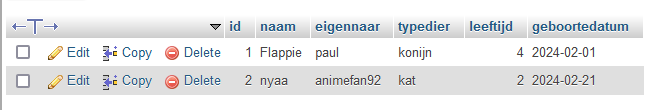
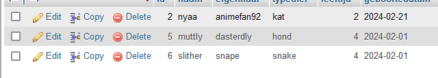

## start

- maak een file aan in de sql directory:
    - `03 limiet.sql`

## TOP

Soms wil je juist niet alle rijen hebben. Bijvoorbeeld als de tabel vol zit met milioenen rijen.

Daar is een commando voor `LIMIT`
> https://dev.mysql.com/doc/refman/8.0/en/select.html zie LIMIT

- maak een select * waarbij je maar 2 rijen selecteerd
    - zet die in `03 limiet.sql`
    - probeer die statement
    > 

- maak een select * waarbij je rij 1 tot en met 3 selecteerd
    - zet die in `03 limiet.sql`
    - probeer die statement
    > 

## klaar?

- commit & push naar je git
            