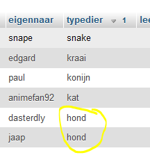
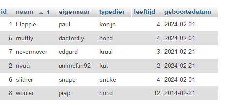
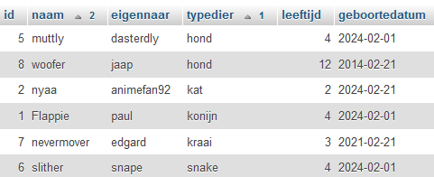
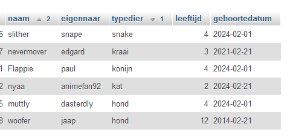

## start

- maak een file aan in de sql directory:
    - `03 order.sql`

## data sorteren

Vaak willen we data sorteren:
- soms vanuit het programma of business case een bepaalde sortering hebben
- soms mag de gebruiker het aangeven waarop het gesorteerd moet worden

## extra data

- zorg dat er in je huisdieren tabel minimaal `2 keer` hetzelfde `typedier ` inzit
> 

## sorteren op naam/alphabet

- zet in `03 order.sql` weer een `select` die `alles` uit `huisdieren` selecteerd
    - zet daar nu `order by naam` achter
    - probeer de statement:
    > 

- je kan ook aangeven `hoe` je wil `sorteren`
    - zet `ASC` achter je statement en probeer uit
    - kopieer je statement
        - zet nu `DESC` achter je statement en probeer uit

## meerdere sorteringen

- zoek nu uit hoe je eerst op `typedier` en daarna op `naam` kan sorteren:
    > 
    - zet die statement ook in `03 order.sql`
- verander de op typedier en naam nu zodat je:
    - `typedier` van A-Z sorteerd
    - `naam` van Z-A sorteerd
    > 

## klaar?

- commit & push naar je git
            
