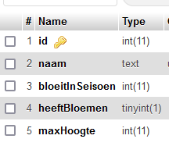

## start


- maak een file aan in de sql directory:
    - `02 where and.sql` 


## AND statement *UITLEG*

- lees het onderstaande:


om op meer dan 1 ding te filteren kunnen we de `AND` gebruiken
bekijk deze tabel:
> 

Met deze data:
> 

Als wij nu alle planten zonder bloemen willen hebben doen we:
```SQL
Select * from planten where heeftBloemen = 0
```
dan krijg je:
> 

Maar stel dat we nog meer willen filteren, Bijvoorbeeld dat de plant kleiner dan 1 meter (100cm) moet zijn:

```SQL
Select * from planten where heeftBloemen = 0 AND maxHoogte < 100
``` 
nu krijg je:
> 

## nieuwe data

zet de volgende data in je huisdieren tabel:

```SQL
INSERT INTO `huisdieren` (`id`, `naam`, `eigennaar`, `typedier`, `leeftijd`, `geboortedatum`) 
VALUES 
(NULL, 'koning hamster', 'joep', 'hamster', '1', '2024-02-01'),
(NULL, 'miss fluffy', 'marije', 'hamster', '2', '2024-02-01'),
(NULL, 'knager', 'joep', 'hamster', '2', '2021-02-21'),
(NULL, 'minizebra', 'marije', 'hamster', '1', '2014-02-21');
```


## And proberen

maak nu de volgende selecties:
- alle huisdieren van joep
    - die ouder dan 1 jaar zijn
- alle huisdieren van joep en marije
    - die 1 jaar zijn
- alle hamsters
    - die 1 jaar zijn

## Eigen and

je had nog meer data in je tabel staan
- maak nog 2 selecties met AND op de table van huisdieren
    - verzin deze zelf!

## klaar?

- commit & push naar je git
            
