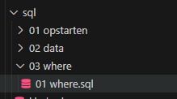
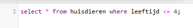
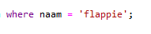

## start

- maak een file aan in de sql directory:
    - `04 where.sql` zoals hier in de screenshot:
    > 

## Selecteren met een conditie

Vaak willen we kunnen zoeken in data. Dat betekent dat wij bevoorbeeld alleen huisdieren van 4 jaar en jonger willen zien

Hoe doen we dat?
met de `WHERE` in SQL

> 

- zet deze statement in `04 where.sql`
    - probeer deze ook uit in `phpmyadmin`
- maak een nieuwe statement die alle huisdieren selecteerd boven de 4 jaar (zonder een leeftijd van 4)
- maak nog een statement die alle huisdieren selecteerd van 4 jaar

## naam zoeken

- nu willen we 1 huisdier vinden op `naam`
    - maak een select statement waar alleen:
        - de `naam` 
        - en `leeftijd` uit komen
    - zet daar nu het volgende achter:
    > 
    - verander `flappie` naar 1 van de namen in jou tabel
        - probeer de statement uit 

## zelf een where

- kies nu 1 van de andere colommen uit `huisdieren` uit
    - maak daar een `select where` van.

## klaar?

- commit & push naar je git
            
