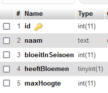
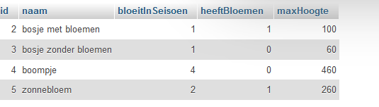
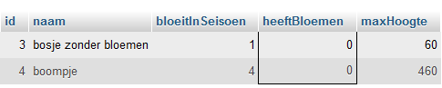
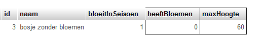

## start


- maak een file aan in de sql directory:
    - `04 where and.sql` 


## AND statement *UITLEG*

- lees het onderstaande:


> om op meer dan 1 ding te filteren kunnen we de `AND` gebruiken
bekijk deze tabel:
>   
> Met deze data:  
> 

- voeg de tabel toe met deze sql:
    ```SQL

    CREATE TABLE `planten` (
    `id` int(11) NOT NULL,
    `naam` text NOT NULL,
    `bloeitInSeisoen` int(11) NOT NULL,
    `heeftBloemen` tinyint(1) NOT NULL,
    `maxHoogte` int(11) NOT NULL
    ) ENGINE=InnoDB DEFAULT CHARSET=utf8mb4 COLLATE=utf8mb4_general_ci;

    ALTER TABLE `planten`
    ADD PRIMARY KEY (`id`);

    ALTER TABLE `planten`
    MODIFY `id` int(11) NOT NULL AUTO_INCREMENT;
    COMMIT;

    INSERT INTO `planten` (`id`, `naam`, `bloeitInSeisoen`, `heeftBloemen`, `maxHoogte`) VALUES (NULL, 'bosje met bloemen', '1', '1', '100'),
  (NULL, 'bosje zonder bloemen', '1', '0', '60'),
  (NULL, 'boompje', '4', '0', '460'),
  (NULL, 'zonnebloem', '2', '1', '260');
 
    ```

    - Als wij nu alle planten zonder bloemen willen hebben doen we:
        ```SQL
        Select * from planten where heeftBloemen = 0
        ```
    - probeer dit zelf ook dan krijg je:
        > 

- lees:
    > Maar stel dat we nog meer willen filteren, Bijvoorbeeld dat de plant kleiner dan 1 meter (100cm) moet zijn:

        ```SQL
        Select * from planten where heeftBloemen = 0 AND maxHoogte < 100
        ``` 
- probeer dat zelf even, nu krijg je:
    > 

## nieuwe data

zet de volgende data in je huisdieren tabel:

```SQL
INSERT INTO `huisdieren` (`id`, `naam`, `eigenaar`, `typedier`, `leeftijd`, `geboortedatum`) 
VALUES 
(NULL, 'koning hamster', 'joep', 'hamster', '1', '2024-02-01'),
(NULL, 'miss fluffy', 'marije', 'hamster', '2', '2024-02-01'),
(NULL, 'knager', 'joep', 'hamster', '2', '2021-02-21'),
(NULL, 'minizebra', 'marije', 'hamster', '1', '2014-02-21');
```


## And proberen

maak nu de volgende selecties:
- alle huisdieren van joep
    - die ouder dan 1 jaar zijn
- alle huisdieren van joep en marije
    - die 1 jaar zijn
- alle hamsters
    - die 1 jaar zijn

## Eigen and

je had nog meer data in je tabel staan
- maak nog 2 selecties met AND op de table van huisdieren
    - verzin deze zelf!

## klaar?

- commit & push naar je git
            
