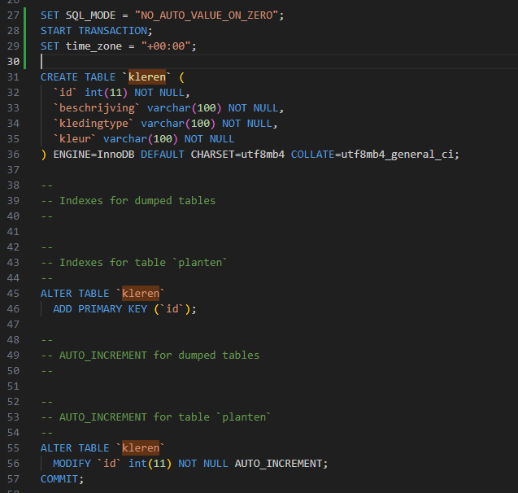
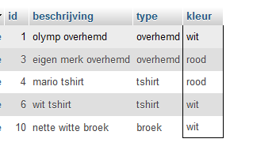

## start


- maak een file aan in de sql directory:
    - `03 where or.sql`


## OR statement *UITLEG*

- lees het onderstaande:

```

Denk bijvoorbeeld aan kleren winkelen online.
Daar kan je op kleur filteren:
- rood
- wit
- blauw
- paars

Vaak is dat dan een:
`ik wil rood OF blauw`

OF vertaald naar OR in het engels. net als de AND kunnen we die gebruiken

```

## tabel maken

- maak deze tabel na:
> 

- zet deze data daarin:
```SQL
INSERT INTO `kleren` (`id`, `beschrijving`, `kledingtype`, `kleur`)
 VALUES 
 (NULL, 'olymp overhemd', 'overhemd', 'wit'),
 (NULL, 'jakes overhemd', 'overhemd', 'blauw'),
 (NULL, 'eigen merk overhemd', 'overhemd', 'rood'),

  (NULL, 'mario tshirt', 'tshirt', 'rood'),
  (NULL, 'planet tshirt', 'tshirt', 'blauw'),
  (NULL, 'wit tshirt', 'tshirt', 'wit'),

  (NULL, 'spijker broek', 'broek', 'blauw'),
  (NULL, 'ripped spijker broek', 'broek', 'blauw'),
  (NULL, 'spijker broek', 'broek', 'zwart'),
  (NULL, 'nette witte broek', 'broek', 'wit') ;
 
```

## OR proberen
- we proberen eerst deze statement even samen:
```SQL
select * from kleren where kleur = "rood" OR kleur = "wit"
```

- dan krijg je dit:
> 

> we gebruiken nu de `OR` om 2 keer dezelfde colom te filteren.
> we kunnen ook 2 verschillende colommen tegelijk filteren:
> - ColomA = Waarde1 `OR` ColomB = Waarde2

## zelf doen

- maak nu een select voor de volgende filters:
    - alle kleren die zwart `OF` blauw zijn
    - alle kleren die zwart `OF` wit zijn
    - alle broeken `OF` tshirts
    

## OR en AND

> we kunnen ook `AND` en `OR` combineren.
> - dit is net als `IF` statements in `javascript` of `php`
>   - *LET OP*, zet je haakjes goed:
>       - `(... OF ...) AND ...`

- maak nu een select voor:
    - alle broeken die zwart `OF` wit zijn
    - alle broeken `EN` overhemden die zwart `OF` wit zijn
    - alle tshirts `EN` overhemden die rood `OF` blauw zijn

## Eigen and

- verzin nu voor huisdieren:
    - een select met een `OF`
    - een select met een `AND` en een `OF`

## klaar?

- commit & push naar je git
            
