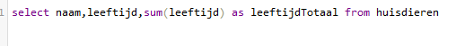
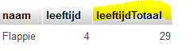
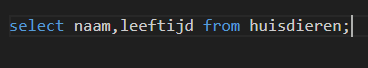
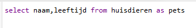
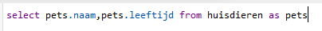

## alias

- maak een nieuwe file aan:
    - `05\alias.sql`
    
> in sql kan je kolommen and tabellen aliassen geven
> laten we een voorbeeld maken:
- selecteer alles (gebruik `*`) uit je huisdieren tabel
    - zet deze SQL in je file

- vervang de `*` door `naam, leeftijd`
    - run de query (sql)
- nu zetten we er nog de volgende kolom bij
    > `,sum(leeftijd)`
    - probeer de query en je krijgt:
    > 

> zie je die laatste kolom? `sum(leeftijd)`... dat leest niet lekker
> daar kunnen we een andere naam aan geven

- maak nu de volgende query na:
    > 
    - probeer die en controlleer wat je krijgt:
    > 

- maak nu aliassen voor `naam` en `leeftijd`:
    - zorg dat je nu engelse woorden gebruikt

## tabel alias

we nemen weer de basis query:
>
- alleen nu geven we de table een alias:
    - maak de query na:
    > 

- nu kunnen we `pets` gebruiken als alias voor de tabel in de kolom select:
    - maak de query na:
    > 

- `pets` kunnen we ook in de where gebruiken
    - maak zelf een query op huisdieren met:
        - `pets` als alias 
        - en een where met 1 van de kolommen waar je `pets.` gebruikt

## klaar?

- commit & push naar je git