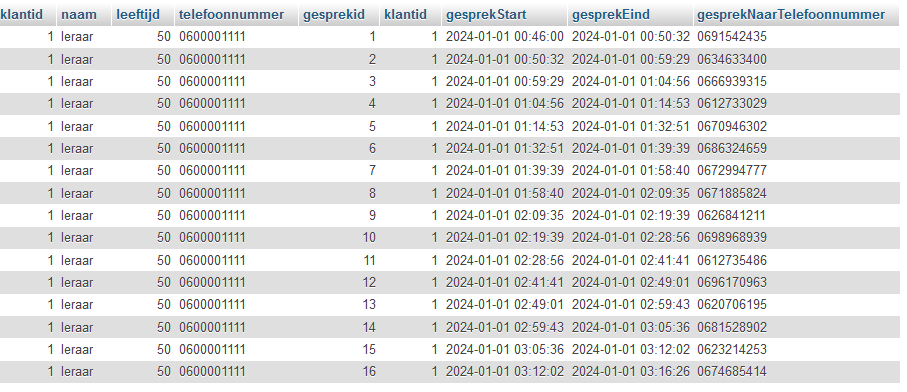

## Klantgesprek

we gaan nu het klantgesprek beter selecteren  
we hadden 2 result sets in php admin maar we willen dit:

maar we willen dit:
> 

- zorg dat je hetzelfde resultaat krijgt als in het plaatje
    - zet je query in `05/join.sql`

#### colommen aanpassen

- kopieer je query
    - pas het aan zodat je maar 1 keer klantid ziet
    - zorg dat je `gesprekid` niet ziet

