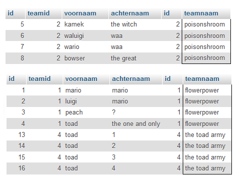

## Tijd om zelf tabellen te maken en te joinen


## start

- maak een nieuwe file aan:
    - `05\teams.sql`

## team tabellen    
*laten we een nieuwe tabellen maken voor een teamsportclub*

- maak zelf 2 nieuwe tabellen die er zo moeten uitzien:
> - teamlid
>    - id
>    - teamid
>    - voornaam
>    - achternaam
> - team
>    - id
>    - teamnaam

> - TIP: *gebruik de scripts die je al hebt als basis*


## data

vul je tabellen met de volgende data ('kopieer'):
```SQL

insert into team (id,teamnaam) values 
(1,'flowerpower'),
(2,'poisonshroom'),
(3,'goombas'),
(4,'the toad army');

insert into teamlid (voornaam,achternaam,teamid) values 
('mario','mario',1),
('luigi','mario',1),
('peach','?',1),
('toad','the one and only',1),

('kamek','the witch',2),
('waluigi','waa',2),
('wario','waa',2),
('bowser','the great',2),


('goomba','1',3),
('goomba','2',3),
('goomba','3',3),
('goomba','4',3),

('toad','1',4),
('toad','2',4),
('toad','3',4),
('toad','4',4);


```

## joins maken


- maak nu de volgende selecties:
    - alle team leden
        - met hun teamnaam
    - alle team leden
        - met hun teamnaam
        - in team `poisonshroom`
    - alle team leden
        - met hun teamnaam
        - in team `flowerpower` en `the toad army`
- controlleer of je dit krijgt:
> 

## klaar?

- commit & push naar je git