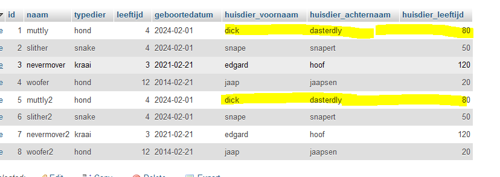

## opstarten

- maak een file aan in de sql directory:
    - `05 eigenaar.sql`

## huisdieren

- bekijk de huisdieren tabel nogmaals
    - zie je die eigenaar?
        - dat is een persoon
            - eigenlijk hoort die in een eigen tabel

> STEL: we willen meer data over de eigenaar:
> - leeftijd, voornaam en achternaam
> - wat gebeurt er dan?

## zien

- Kijk naar het plaatje hieronder
    - hier hebben we de data in dezelfde table gezet
> 
    - zie je dat de data er 2 keer instaat?

> UITLEG
> Dit neemt extra veel data in beslag en is foutgevoelig.  
> *DUS* als we de eigenaar in een aparte tabel zetten kunnen we ook data van de eigenaar daar in zetten, en staat het niet dubbel

## Huisdiereigenaar Tabel

- maak een nieuwe tabel 
    - geef de tabel de naam `huisdiereigenaar`
    - geef de tabel de volgende colommen:
        - id, INT 
        - voornaam, varchar(120)
        - achternaam, varchar(120)
        - leeftijd, INT 
- exporteer de nieuwe tabel
    - zet die SQL in `05 eigenaar.sql`

## Data

- maak nu voor elke `eigenaar` in `huisdieren` een rij in `huisdiereigenaar`
    - zet de insert statements ook in `05 eigenaar.sql`

## klaar?

- commit & push naar je git
            
