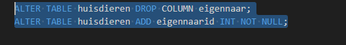

## 2 tabellen

Nu hebben we 2 tabellen:
- eigenaar
- huisdieren

## de eigenaar aan de huisdieren koppelen

> in huisdieren staat nu nog de colom `eigenaar` 
> die moet weg!

- maak een nieuwe file:
    - `05 alterhuisdier.sql`
        - daar zetten we het volgende in:
        > 
        - dan krijg je:
        > 

