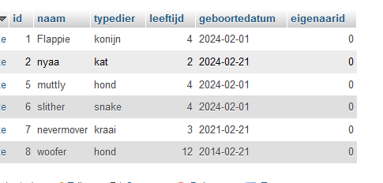
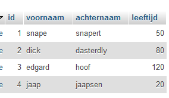
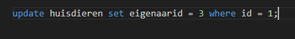
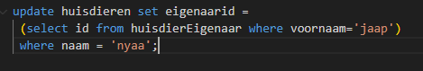

## update

- kijk nogmaals naar jouw data:
    > 
- eigenaarid `0`? klopt dat? nope
    - we gaan nu update statements gebruiken om dit te repareren
        - bekijk jouw eigenaar tabel
        > 

- bedenk welke huisdieren welke eigenaren hebben en zoek de eigenaarid (id in de eigenaar colom)

> Als wij flappie de eigenaar `edgard` willen geven doen we dit:
> 

- zorg dat al jouw huisdieren weer een eigenaar krijgen met de update statement

## EXTRA: andere manier

- deze is wat ingewikkelder maar dit is voor ons wat leesbaarder
    > *LETOP* maar is wel LANGZAMER voor de computer
    > 
    - maak nu update statements die het op de manier hierboven doen

## klaar?

- commit & push naar je git
            