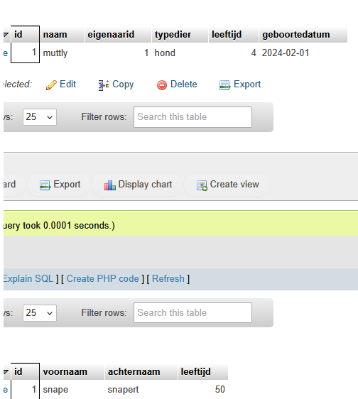

## selecteren

Vanuit onze code kunnen we in 2 stappen selecteren:
> - selecteer alle huisdieren
>    - `foreach` huisdier selecteer de eigenaar erbij

- maak nu de sql statements die je nodig hebt om 1 huisdier + eigenaar te selecteren
    - zet dat in `05 select2.sql`
    - probeer die uit in phpmyadmin voor 1 huisdier
        > zie het voorbeeld hieronder (en zie ook dat we 2 x een resultaat hebben)
        > 

## 2 resultaten

We kunnen nu in code wel 2 resultaten selecteren en aan elkaar knopen
- alleen dat is niet ideaal

## klaar?

- commit & push naar je git