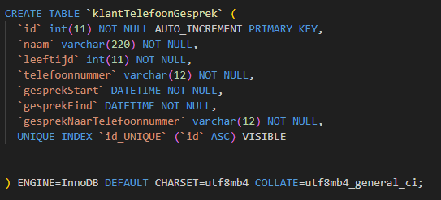

## normaliseren

Jij moet ook tabellen kunnen designen en dus ook kunnen normaliseren
(de dubbele data eruit halen)

laten we dat eens gaan proberen

## telefoon rekening

- maak een nieuwe sql file:
    - `04/telefoon.sql`
- lees de volgende business case:
    ```
    Jij moet een database maken waar een telefoon provider klantgesprekken kan bijhouden:
    - een klant heeft de volgende gegevens:
        - naam
        - leeftijd
        - telefoonnummer
    - een klant gesprek heeft de volgende gegevens:
        - start datum tijd
        - eind datum tijd
        - naar welk nummer
    Design hier een database voor

    ```
## tabel maken

- We beginnen nu met het maken van 1 tabel:
    - maak deze na in `04/telefoon.sql`
    > 


## Data vullen


- zet deze data in je nieuwe tabel:
```SQL

INSERT INTO `klantTelefoonGesprek` (`id`, `naam`, `leeftijd`, `telefoonnummer`, `gesprekStart`, `gesprekEind`, `gesprekNaarTelefoonnummer`)
 VALUES 
(NULL,"leraar",50,"0600001111",'2024-01-01 00:46:00', '2024-01-01 00:50:32', '0691542435'),
(NULL,"leraar",50,"0600001111",'2024-01-01 00:50:32', '2024-01-01 00:59:29', '0634633400'),
(NULL,"leraar",50,"0600001111",'2024-01-01 00:59:29', '2024-01-01 01:04:56', '0666939315'),
(NULL,"leraar",50,"0600001111",'2024-01-01 01:04:56', '2024-01-01 01:14:53', '0612733029'),
(NULL,"leraar",50,"0600001111",'2024-01-01 01:14:53', '2024-01-01 01:32:51', '0670946302'),
(NULL,"leraar",50,"0600001111",'2024-01-01 01:32:51', '2024-01-01 01:39:39', '0686324659'),
(NULL,"leraar",50,"0600001111",'2024-01-01 01:39:39', '2024-01-01 01:58:40', '0672994777'),
(NULL,"leraar",50,"0600001111",'2024-01-01 01:58:40', '2024-01-01 02:09:35', '0671885824'),
(NULL,"leraar",50,"0600001111",'2024-01-01 02:09:35', '2024-01-01 02:19:39', '0626841211'),
(NULL,"leraar",50,"0600001111",'2024-01-01 02:19:39', '2024-01-01 02:28:56', '0698968939'),
(NULL,"leraar",50,"0600001111",'2024-01-01 02:28:56', '2024-01-01 02:41:41', '0612735486'),
(NULL,"leraar",50,"0600001111",'2024-01-01 02:41:41', '2024-01-01 02:49:01', '0696170963'),
(NULL,"leraar",50,"0600001111",'2024-01-01 02:49:01', '2024-01-01 02:59:43', '0620706195'),
(NULL,"leraar",50,"0600001111",'2024-01-01 02:59:43', '2024-01-01 03:05:36', '0681528902'),
(NULL,"leraar",50,"0600001111",'2024-01-01 03:05:36', '2024-01-01 03:12:02', '0623214253'),
(NULL,"leraar",50,"0600001111",'2024-01-01 03:12:02', '2024-01-01 03:16:26', '0674685414');

```

## select

- selecteer nu alles (*) uit je tabel
    - schrijf zelf de sql!

## dubbele data

- bekijk de data goed
    - schrijf voor jezelf op welke data dubbel is

## 2 tabellen

- we gaan deze tabel nu in 2 tabellen splitsen:
    - klant
        - `klantid`,`naam`, `leeftijd`, `telefoonnummer` horen hierbij
    - telefoongesprek:
        - `gesprekStart`, `gesprekEind`, `gesprekNaarTelefoonnummer` horen hier bij
    - maar hoe koppelen we nu de tabellen?
        - geef telefoongesprek voor nu even de colommen:
            - `gesprekid`
            - `klantid`

## zelf normaliseren

- maak in `05\telefoongespreknorm.sql` de tabellen
    - schrijf zelf de sql
        > TIP: gebruik `telefoongesprek.sql` als basis
        > - let wel op dat de id colom anders heet!

## testen

- maak je tabellen aan met het SQL script in phpmyadmin

- zet deze data in je nieuwe tabellen:
```SQL


INSERT INTO `klant` (`klantid`, `naam`, `leeftijd`, `telefoonnummer`)
 VALUES 
(1,"leraar",50,"0600001111");

INSERT INTO `telefoonGesprek` (`gesprekid`, `klantid`,  `gesprekStart`, `gesprekEind`, `gesprekNaarTelefoonnummer`)
 VALUES 
(NULL,1,'2024-01-01 00:46:00', '2024-01-01 00:50:32', '0691542435'),
(NULL,1,'2024-01-01 00:50:32', '2024-01-01 00:59:29', '0634633400'),
(NULL,1,'2024-01-01 00:59:29', '2024-01-01 01:04:56', '0666939315'),
(NULL,1,'2024-01-01 01:04:56', '2024-01-01 01:14:53', '0612733029'),
(NULL,1,'2024-01-01 01:14:53', '2024-01-01 01:32:51', '0670946302'),
(NULL,1,'2024-01-01 01:32:51', '2024-01-01 01:39:39', '0686324659'),
(NULL,1,'2024-01-01 01:39:39', '2024-01-01 01:58:40', '0672994777'),
(NULL,1,'2024-01-01 01:58:40', '2024-01-01 02:09:35', '0671885824'),
(NULL,1,'2024-01-01 02:09:35', '2024-01-01 02:19:39', '0626841211'),
(NULL,1,'2024-01-01 02:19:39', '2024-01-01 02:28:56', '0698968939'),
(NULL,1,'2024-01-01 02:28:56', '2024-01-01 02:41:41', '0612735486'),
(NULL,1,'2024-01-01 02:41:41', '2024-01-01 02:49:01', '0696170963'),
(NULL,1,'2024-01-01 02:49:01', '2024-01-01 02:59:43', '0620706195'),
(NULL,1,'2024-01-01 02:59:43', '2024-01-01 03:05:36', '0681528902'),
(NULL,1,'2024-01-01 03:05:36', '2024-01-01 03:12:02', '0623214253'),
(NULL,1,'2024-01-01 03:12:02', '2024-01-01 03:16:26', '0674685414');

```

## select en bekijk

- selecteer `beide` tabellen:
    - in `1 keer `
    - met `2 queries` in phpadmin

- zie je dat we nu met `klantid` in `telefoonGesprek` naar `klant` wijzen?
    - dit is belangrijk want dat is de basis voor `relaties` en `joins`
    
## klaar?

- commit & push naar je git