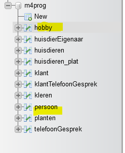
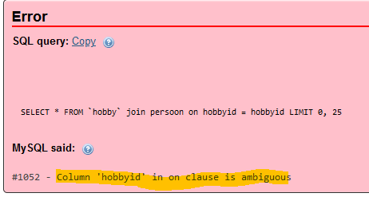
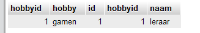
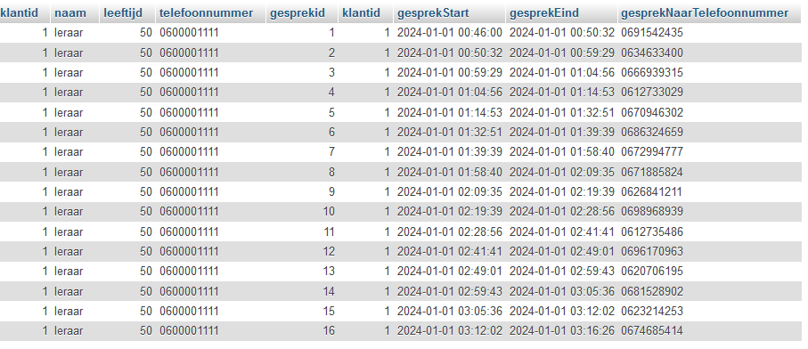

## Table alias

Voordat we aan joins beginnen moeten we wat leren over aliassen.

voorbeeld:
```SQL
SELECT * FROM `huisdieren` HD WHERE HD.id =1; 
```

- bekijk de query en lees het onderstaande:
> - Hierboven zien we *`huisdieren` HD* staan
> - HD is nu een naam van de tabel `huisdieren` geworden
> - als we `HD.` typen krijgen we nu `altijd` de `kolommen` van de tabel `huisdieren`
> - dit is belangrijk als we 2 tabellen in 1 keer gaan selecteren:
>   - als 2 tabellen alletwee een `id` hebben wat dan? Dat werkt niet

## Tabel maken voor het voorbeeld:

- run de volgende sql:

```SQL
CREATE TABLE `persoon` (
  `id` int(11) NOT NULL AUTO_INCREMENT PRIMARY KEY,
  `hobbyid` int(11) NOT NULL,
  `naam` varchar(150) NOT NULL,
  UNIQUE INDEX `persoonid_UNIQUE` (`id` ASC) VISIBLE
) ENGINE=InnoDB DEFAULT CHARSET=utf8mb4 COLLATE=utf8mb4_general_ci;


CREATE TABLE `hobby` (
  `hobbyid` int(11) NOT NULL AUTO_INCREMENT PRIMARY KEY,
  `hobby` varchar(150) NOT NULL,
  UNIQUE INDEX `hobbyid_UNIQUE` (`hobbyid` ASC) VISIBLE
) ENGINE=InnoDB DEFAULT CHARSET=utf8mb4 COLLATE=utf8mb4_general_ci;

INSERT INTO `hobby` ( `hobbyid`,`hobby`) VALUES (1,"gamen");
INSERT INTO `persoon` ( `naam`,`hobbyid`) VALUES ("leraar",1);
```

- nu heb je 2 tabellen erbij:
> 

#### in 1 keer

- we gaan hobby en persoon in 1 keer selecteren:
    - dat doen we door `hobbyid` uit `persoon` aan `hobbyid` van `hobby` te koppelen:
        ```SQL
         SELECT * FROM hobby join persoon on hobbyid = hobbyid;
        ```
        - probeer de query
          - je krijgt een fout:
          > 

#### alias to the rescue?

- geef nu `hobby` een alias `h`
- geef nu `persoon` een alias `p`
  - gebruik nu `p` en `h` in het `hobbyid = hobbyid` stuk
    - als je het goed doet werkt het nu wel:
    > 

- zie je hoe de data van beide tabellen in 1 resultaat staat?
  > zo kan je dus data uit beide tabellen combineren

#### ik wil niet alles

- maak een nieuwe file aan:
    - `06\join.sql`

- zie je de `*` in de query hieronder?
```SQL
  SELECT * FROM hobby join persoon on hobbyid = hobbyid;
```
- vervang die zodat je de volgende kolommen selecteerd:
  - hobbyid van tabel hobby
    > - gebruik een tabel alias 
  - hobby van tabel hobby
  - id van persoon
    - gebruik een colom alias:
      - zorg dat colom als persoonid te zien is in het resultaat
  - naam van persoon
    > - gebruik een tabel alias 
- bewaard deze query in:
    - `06\alias.sql`

- controlleer of je het volgende hebt:
> 

## klaar?

- commit & push naar je git