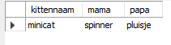

## katten en kittens

- maak nu 2 nieuwe tabellen:
    - kat en kitten
        - een KITTEN heeft 2 KATTEN als ouders:
            - een mama 
            - een papa
            - zorg dat dat werkt met relaties en constraints

## data

- test het door de volgende data toe te voegen:
```SQL

insert into kat (id,naam) values 
(1,'spinner'),
(2,'pluisje');
insert into kitten (mamaId,papaId,naam) values 
(1,2,'minicat');

```


## JOIN!

- selecteer nu de tabellen kat en kitten met een join zodat je dit krijgt:
> 
    - sla deze query ook op
    
## klaar?

- commit & push naar je git