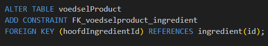

## relatie leggen

om een relatie te leggen met een constraint gebruiken we de volgende SQL:


```SQL
 ALTER TABLE `WELKE_TABEL_EEN_VERWIJZING HEEFT`
 ADD CONSTRAINT FK_`tabelNaam1`_`tabelNaam2`
 FOREIGN KEY (`COLOM_UIT_DE_TABEL_MET_VERWIJZING`) REFERENCES  
 `DE_TABEL_WAAR_NAAR_GEWEZEN_WORDT`(`DE_COLOM_WAAR_NAAR_GEWEZEN_WORDT`);
```

- best lastig toch?
    - even goed uit elkaar plukken:
    > voedselProduct `HEEFT` een ingredient
    > - voedselProduct `WIJST` dus naar ingredient
    >   - met de colom `hoofdIngredientId`
- plak de volgende SQL in je `.sql` file

```SQL
 ALTER TABLE TABEL1
 ADD CONSTRAINT FK_TABEL1_TABEL2
 FOREIGN KEY (TABEL1_COLOM) REFERENCES  
 TABEL2(TABEL2_COLOM);
```

- vervang `TABEL1_COLOM` door `hoofdIngredientId`
- vervang `TABEL2_COLOM` door `id`
- vervang `TABEL1` door `voedselProduct`
- vervang `TABLE2` door `ingredient`
- dan wordt het:  
    > 

## insert?

- gebruik nu de volgende sql:
```SQL
insert into voedselProduct (hoofdIngredientId,naam) values 
(2,'honingkoek');
```

- dat werkt niet:
    > Error Code: 1452. Cannot add or update a child row: a foreign key constraint fails (`m4prog`.`voedselproduct`, CONSTRAINT `FK_voedselproduct_ingredient` FOREIGN KEY (`hoofdIngredientId`) REFERENCES `ingredient` (`id`))
    - waarom niet? lees de fout en bedenk dat zelf
- zorg er nu voor dat je `honing` toevoegt als `ingredient`

- zet de statements in je `.sql` file

## volgorde

- laten we nog een SQL statement proberen:
```SQL

insert into voedselProduct (hoofdIngredientId,naam) values 
(3,'bosbessenkwark');

insert into ingredient (id,naam) values 
(3,'bosbessen');

```

- we krijgen weer dezelfde fout?
    - hoe komt dit? Zorg dat het wel gaat werken en sla dat op in je `.sql` file


## klaar?

- commit & push naar je git