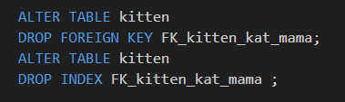

## relaties

*UITLEG*
elke foreign key kan ook acties nemen als er iets:
- gedelete wordt
- geupdate wordt

als bijvoorbeeld een kat uit de tabel wordt gehaald, dan kan je:
 - de kitten ook weghalen
 - de papa of mama van de kitten op NULL zetten
 - het tegenhouden
 - niets doen

waarom? omdat we graag de data compleet houden of in een werkende staat houden

## proberen

- we gaan nu de foreign key aanpassen:
    - neem de volgende SQL over:
        >
- doe hetzelfde voor de papa foreign key

## kat weggooien

- selecteer eerst alles uit de tabellen:
    - kitten
    - kat
- nu gaan we 1 van de katten weggooien:
    >
    
- selecteer nu weer alles
    - zie je dat de kitten ook weg is?

## tegenhouden

- We doen nu hetzelfde, alleen veranderen we `CASCADE` naar `RESTRICT`
    >

- zet je data weer klaar:
```SQL

insert into kat (id,naam) values 
(1,'spinner');
insert into kitten (mamaId,papaId,naam) values 
(1,2,'minicat');

```

- probeer nu de kat te deleten
    >
    - kijk nu mag het niet

## NULL zetten

- We doen nu hetzelfde, alleen veranderen we `CASCADE` naar `SET NULL`
    >
    - wacht dit werkt niet?
        - hoe komt dat? bekijk de colom mamaId en papaId eens

## klaar?

- commit & push naar je git
