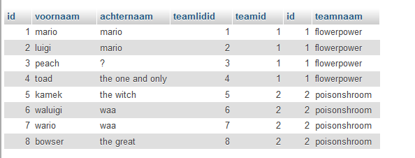
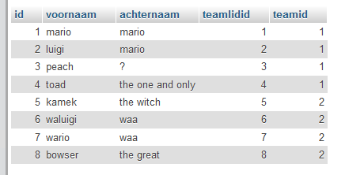
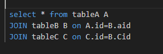

## start

- maak een nieuwe file aan:
    - `08\joins.sql`

## wat willen we? (UITLEG)

> - nu willen we een select uitvoeren over 3 tabellen
> - wat we willen krijgen:
>

## stap 1

- maak de volgende query in `08\joins.sql`
- select alles uit `teamlidv2`
    - join nu `teamlidv2_teamv2` eraan
        - doe dit op teamid

- probeer je query je krijgt:
>

## stap 2

- kopieer je query uit stap 1
- we maken nu een extra join, zie het voorbeeld hieronder:
>
- join nu `teamlidv2` eraan
    - doe dit op teamlidid

- probeer je query, je krijgt nu:
>

## klaar?

- commit & push naar je git