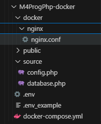
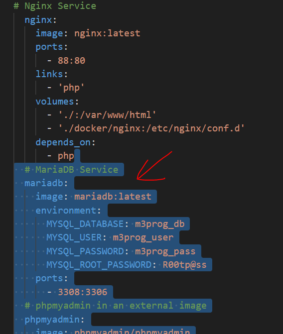

## Docker aanpassen

Onze docker heeft maar 2 services:
- phpmyadmin
- mariadb

maar om het met php te gebruiken hebben we meer nodig!

## M3Prog

- maak een nieuwe map:
    - `M4ProgPhp-docker`
- zet daar de files uit m3prog_project in (zie deze 09 mix met php map)
   - controlleer of je dit hebt:
     

## docker M4Prog aanpassen

- open je `M4Prog` docker-compose.yml
    - deze heeft andere services (mariadb & phpmyadmin), deze zetten we erbij:
        >
    
## docker compose

- maak nu je docker aan met docker compose
## klaar?

- commit & push naar je git