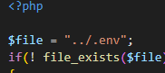

## Docker aanpassen

Onze docker heeft maar 2 services:
- phpmyadmin
- mariadb

maar om het met php te gebruiken hebben we meer nodig!

## M3prog les 6

- had je `les 6` van `M3Prog` nog niet gemaakt?
    - doe dat nu!
    - https://github.com/progsen/M3Prog_backend/tree/main/les-6

## docker M4Prog aanpassen

in M3Prog hadden we een docker met 4 services!


- maak een nieuwe map:
    - `M4ProgPhp-docker`
- kopieer je `M4Prog` docker-compose.yml naar die map
- maak de juiste `folders` aan:
    - `source` (`neem` ook de files mee)
    - `docker` (`neem` ook de files mee)
    - `public` (maak deze `leef`)
- pas je `docker-compose.yml` aan zodat deze lijkt op die van `M3Prog`
- gebruik overal `M4Prog` in plaats van `M3Prog`
- pas je `.env`aan zodat die de m4prog gegevens gebruikt!
- in `config.php` verander:
    - `../../.env` naar `../.env`
    > 

- maak in public een `index.php`
    - zet daar het volgende in:

```php
<?php


include_once("../source/database.php");

$connection = database_connect();

$result = $connection->query("SELECT 'het werkt' as nice");

print_r($result->fetch_all());

```

## testen

- `start` je `M4ProgPhp-docker` docker
    - open je `index.php`
    > 
    
## klaar?

- commit & push naar je git