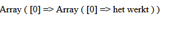

## .env

- open je .env file
    - kijk even goed, begrijp je alle waardes?
    - pas nu het wachtwoord aan

- open ook je source/database.php
    - lees de code
        - zie je waar je waardes uit .env gebruikt worden?

- kijk nu naar config.php
    - probeer de code te lezen en begrijpen.
        - begrijp je iets niet? zoek het op!


## index.php

- maak in public een `index.php`
    - zet daar het volgende in:

```php
<?php


include_once("../source/database.php");

$connection = database_connect();

$result = $connection->query("SELECT 'het werkt' as nice");

print_r($result->fetch_all());

```

## testen

- `start` je `M4ProgPhp-docker` docker
    - open je `index.php`
    > 
    
## klaar?

- commit & push naar je git