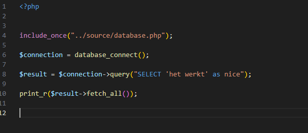
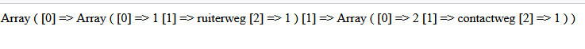
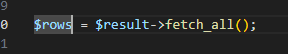
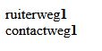

## phpmyadmin op!

- open phpmyadmin
- controlleer of het m4prog schema is leeg is
    > er staan geen tabellen in als het goed is

## tabel maken

- gebruik deze sql om een tabel te maken:
    ```sql
    CREATE TABLE `huis` (
    `id` INT NOT NULL AUTO_INCREMENT,
    `straat` VARCHAR(120) NOT NULL,
    `huisnummer` INT NOT NULL,
    PRIMARY KEY (`id`),
    UNIQUE INDEX `id_huis_UNIQUE` (`id` ASC) VISIBLE)
    ENGINE = InnoDB;

    ```

- maak een sql file: 09_huis.sql
- zet daar de CREATE sql in 
- gebruik phpmyadmin om 2 rijen in de tabel te zetten MAAR!
    - bewaar de INSERT in de .sql file


## index.php

- maak in public een `huis.php`
    - zet daar de database code van index.php in:
        > 
- pas nu de SELECT aan:
    - zorg dat je de rijen uit huis selecteert

## testen

- `start` je `M4ProgPhp-docker` docker
    - open je `huis.php`
        > 

## FOR

- je ziet dat de tabel data als een array in php komt?
    - we veranderen de print_r:
        > 
    
    - maak nu een for loop die over rows loopt en gebruik deze html per item:
    ```HTML
    <label>STRAAT</label><b>HUISNUMMER</b></br>
    ```
    - vervange STRAAT en HUISNUMMER met de data uit de tabel
    - dan krijg je dit:
        > 
    
## klaar?

- commit & push naar je git