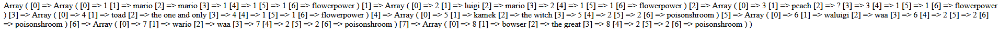
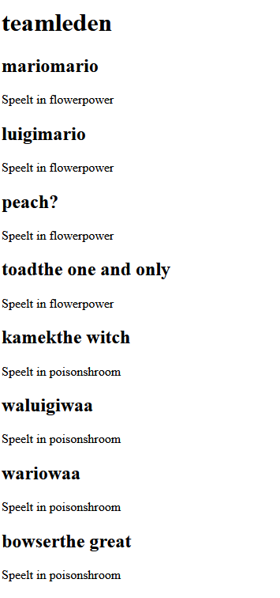
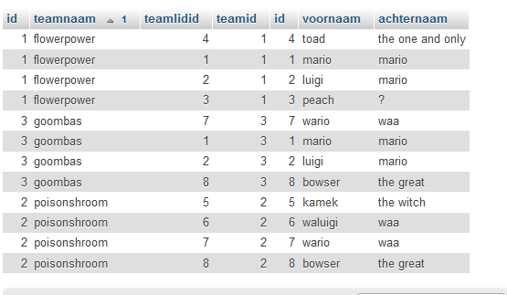
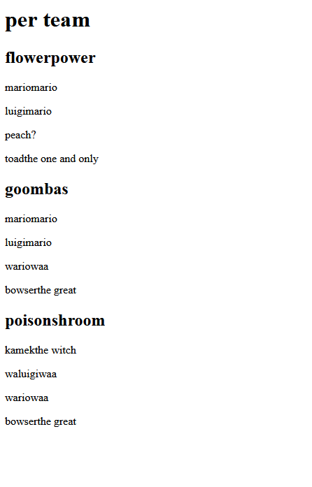

## Teams

- maak een nieuwe php file:
    - in `public`
        - `teams.php`

## database klaarzetten

- maak de tabellen zoals je die in `08 koppeltabellen/` gemaakt had aan

## select mario teams

> HINT kijk in index.php
- maak een connectie 
    - select alles uit de teams net als in `08 koppeltabellen/02 koppelselect.md`
        >

- print nu de resultaten:
    > 
    - zie je dat het een array is?, daar kan je over loopen

- maak met het resultaat een html pagina:
    > 
    

## meer data

- voer uit!:
    ```SQL
    insert into teamlidv2_teamv2 (teamlidid,teamid) values 
    (1,3),
    (2,3),
    (7,3),
    (8,3);
    ```

- bekijk of je nu spelers dubbel in de lijst hebt staan

## per team

- maak nu de select anders zodat je per team selecteerd
    > 

## nieuwe html

- maak een `byteam.php`
    - zorg dat je dit resultaat krijgt:
        > 

## klaar?

- commit & push naar je git