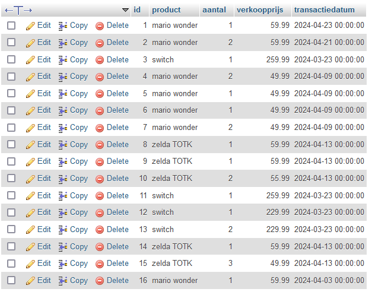
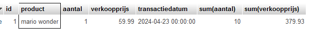
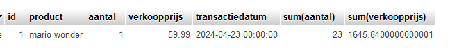
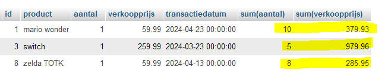

## groeperen

*UITLEG*
> Als we een tabel hebben waar rijen instaan per ding/klant/product en we willen optellen per product
kunnen we een GROUP BY gebruiken

## tabel maken

- maak nu de table aan met de volgende file:
    - [sql/verkochtproduct.sql](sql/verkochtproduct.sql)

- bekijk de data in de tabel
    > 

## select
- maak een nieuwe sql file:
    - `10 group by.sql`
- probeer nu een select te maken die:
    - alleen mario wonder bekijkt
    - het aantal verkochte producten optelt
    - het totaal bedrag optelt
    > 

## per product???

- kopieer je query en haal (in de kopie) de where weg en voer de query uit
    > 

> Nu tellen ook de switches mee? en zelda? dat is niet nuttig

## per product!

- wat we missen is een group by
    - gebruik een group by op product om het volgende te krijgen:
    > *LET OP `group by` moet als LAATSTE!*
    > 
    
> NICE! nu hebben we een mooi overzicht, hiervan kan je weer verkoop cijfers uitrekenen, voorraden bekijken, grafieken maken etc. super handig!

## klaar?

- commit & push naar je git