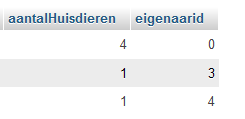

## count UITLEG

net als sum hebben we *count*
count telt het aantal rijen

## proberen

- probeer nu de volgende sql uit:
```SQL
SELECT count(*) FROM `huisdieren`
```

- maak nog 2 andere *count* sql statements
    - gebruik daarvoor andere tabellen
    - sla de SQL op in 
        - `10 group by.sql`

## count en group by

- gebruik de huisdieren tabel
    - gebruik een `count(*)` en een group by om een select te maken die laat zien:
        - hoeveel huisdieren elke eigenaar heeft:
        > 
        - gebruik ook een alias om de count(*) te verbergen

        
## klaar?

- commit & push naar je git