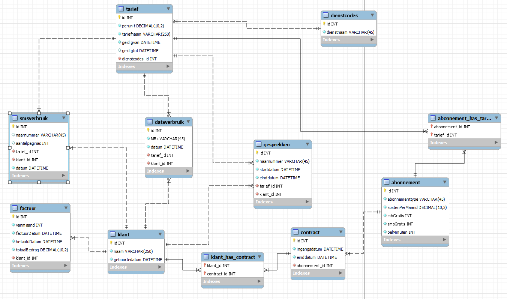

## Klantgesprek

laten we nu een wat complexere database gebruiken om joins te proberen

- download de volgende sql files:
    > DOET DIT IN VOLGORDE VAN BOVEN NAAR BENEDEN!
    1) [mobileproviderDB/database.sql](mobileproviderDB/database.sql)
    2) [mobileproviderDB/dataverbruik.sql](mobileproviderDB/dataverbruik.sql)
    3) [mobileproviderDB/gesprekverbruik.sql](mobileproviderDB/gesprekverbruik.sql)
    4) [mobileproviderDB/smsverbruik.sql](mobileproviderDB/smsverbruik.sql)

## design bekijken

- bekijk het plaatje hieronder. Dit is de hele database
    - kijk of je begrijpt hoe alles aan elkaar verbonden is
    >